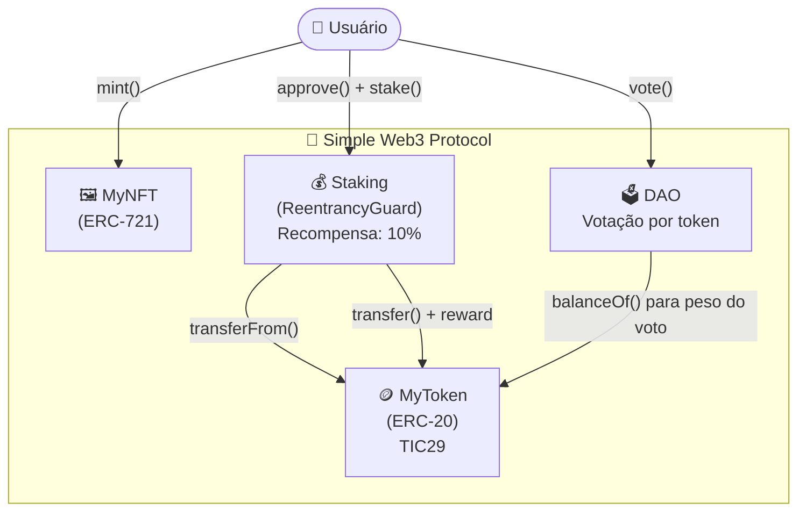

# 🚀 Simple Web3 Protocol

## 🌐 Contratos (Sepolia)

Os contratos foram implantados na rede Sepolia e podem ser consultados publicamente:

- 🪙 Token: https://sepolia.etherscan.io/address/0xf2d325511E757ba769Bd773606f481D28d6C11aF
- 🖼️ NFT: https://sepolia.etherscan.io/address/0x759A9D67548e3237bb4977DcEF91Dbb88c4bC89A
- 💰 Staking: https://sepolia.etherscan.io/address/0x67eF82876730b46BDEE07cA3105ba25a8f8e9494
- 🗳️ DAO: https://sepolia.etherscan.io/address/0x44c2c5Cc881bC8b2720a15C3dA63a9285f911aA2

### 🔍 Código verificado (Blockscout)

- Token: https://eth-sepolia.blockscout.com/address/0xf2d325511E757ba769Bd773606f481D28d6C11aF#code

---

## 📌 Descrição

Projeto Aula Residência TIC29 - Web3

Este projeto consiste no desenvolvimento de um protocolo Web3 básico utilizando Solidity e Hardhat.

O sistema implementa funcionalidades essenciais do ecossistema blockchain:

- Token ERC-20
- NFT ERC-721
- Staking com recompensa
- Governança simples (DAO)

---

## ⚙️ Tecnologias Utilizadas

- Solidity ^0.8.x
- Hardhat
- OpenZeppelin
- Ethers.js
- Sepolia Testnet

---

## 🗺️ Diagrama de Arquitetura



---

## 🧱 Arquitetura do Projeto

O projeto é composto por 4 contratos principais:

### 🪙 Token (ERC-20)

- Nome: Tic29
- Símbolo: TIC29
- Responsável por representar o ativo principal do sistema

### 🖼️ NFT (ERC-721)

- Permite a criação de tokens únicos (mint)

### 💰 Staking

- Permite depósito de tokens
- Recompensa fixa de 10%
- Protegido contra reentrancy via `ReentrancyGuard` (OpenZeppelin)

### 🗳️ DAO

- Sistema simples de votação baseado em tokens

---

## 🚀 Deploy (Sepolia)

- Token: `0xf2d325511E757ba769Bd773606f481D28d6C11aF`
- NFT: `0x759A9D67548e3237bb4977DcEF91Dbb88c4bC89A`
- Staking: `0x67eF82876730b46BDEE07cA3105ba25a8f8e9494`
- DAO: `0x44c2c5Cc881bC8b2720a15C3dA63a9285f911aA2`

---

## 🧪 Funcionalidades Testadas

- ✔️ Aprovação de tokens (approve)
- ✔️ Staking de tokens
- ✔️ Retirada com recompensa
- ✔️ Mint de NFT
- ✔️ Votação na DAO

---

## ▶️ Como executar o projeto

```bash
npm install
npx hardhat compile
npx hardhat run scripts/deploy.ts --network sepolia
```

---

## 🔐 Segurança

- Uso de OpenZeppelin (contratos auditados)
- Solidity ^0.8.x (proteção contra overflow nativa)
- `ReentrancyGuard` aplicado no contrato de Staking
- Variável `token` declarada como `immutable`
- Validações com `require` em funções críticas
- Auditoria estática realizada com **Slither** — ver [`audit-report.md`](./audit-report.md)

---

## 🌐 Oráculos

A integração com oráculos pode ser realizada via Chainlink para consumo de dados externos. Nesta versão, a funcionalidade foi simplificada.

---

## 👨‍💻 Autor

Edu
https://www.linkedin.com/in/educarlos29/